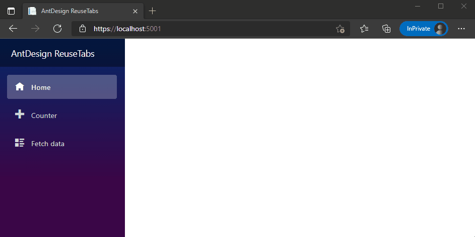

# ReuseTabs

A reuse tabs demo for [Ant Design Blazor](https://github.com/ant-design-blazor/ant-design-blazor).

# Demo

https://antblazor.com/demo-reuse-tabs/

# ScreenShot



# How to use

## Prerequisites

Follow the installation steps of AntDesign and install the AntDeisgn dependencies.

## Basic case

1. First of all, create a blazor project using `dotnet new` command.

2. Modify the `App.razor` file, replace the `RouteView` with `ReuseTabsRouteView`.

    ```diff
    <Router AppAssembly="@typeof(Program).Assembly">
        <Found Context="routeData">
    -       <RouteView RouteData="@routeData" DefaultLayout="@typeof(MainLayout)" / >
    +       <ReuseTabsRouteView RouteData="@routeData" DefaultLayout="@typeof(MainLayout)" />
        </Found>
        ...
    </Router>

    ```

3. Then modify the `MainLayout.razor` file, add the `ReuseTabs` component. Note that @Body is not required at this case.

    ```diff
    @inherits LayoutComponentBase

    <div class="page">
        <div class="sidebar">
            <NavMenu />
        </div>

        <div class="main">
    -       <div class="top-row px-4">
    -           <a href="http://blazor.net" target="_blank" class="ml-md-auto">About</a>
    -       </div>
    -       <div class="content px-4">
    -           @Body
    -       </div>
    +       <AntDesign.ReuseTabs Class="top-row px-4" TabPaneClass="content px-4" / >
        </div>
    </div>

    ```

## Customize tab title

- If it's just text, you can use the `ReuseTabsPageTitle` attribute.

    ```diff
    @page "/counter"
    + @attribute [ReuseTabsPageTitle("Counter")]
    ```

- If you want to use a template, then implement the IReuseTabsPage interface and implement the method

    ```diff
    @page "/"
    + @implements IReuseTabsPage

    <h1>Hello, world!</h1>

    @code{
    +   public RenderFragment GetPageTitle() =>
    +       @<div>
    +           <Icon Type="home"/> Home
    +       </div>
    +   ;
    }
    ```